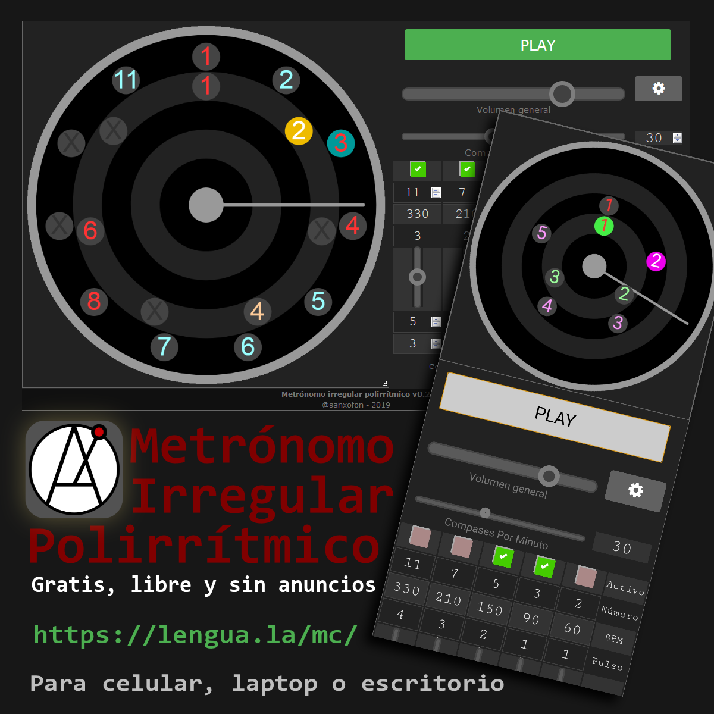

# Circular Polyrhythmic Metronome
This is a progressive web app, a circular polyrythmic metronome and, as a bonus, accepts Rythmic "Claves" as defined by La Lengua Group in https://lengua.la/ri

In can be used in any modern browser and it can be installed as an offline app on any android or windows device.

## Online Demo
https://lengua.la/mc/

&

https://lengua.github.io/mc/

### Coded by
Santiago C. Novaro ([@sanxofon](https://twitter.com/sanxofon))
